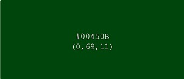
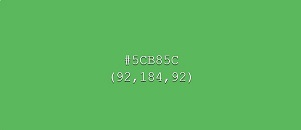

# Home Jungle
This is an e-commerce website for selling plants and plant decoration. 
The website will be a site where users can browse through plants and plant decoration and will be able to purchase them. 

_This app is made for educational use only._

## Deployed Site
[Live website](https://home-jungle.herokuapp.com/)

## Index
- [UX](#ux)
  - [User Stories](#user-stories)
  - [Strategy](#strategy)
  - [Scope](#scope)
  - [Structure](#structure)
  - [Code Structure](#code-structure)
  - [Skeleton](#skeleton)
  - [Surface](#surface)
  - [Mockups](#mockups)
- [Features](#features)
  - [Database Schema](#database-schema)
  - [Features left to implement](#features-left-to-implement)
- [Technologies](#technologies)
  - [Deployment](#deployment)
  - [Setting up Heroku](#setting-up-heroku)
  - [Deploying to Heroku](#deploying-to-heroku)
  - [Committing files to GitHub](#committing-files-to-github)
- [Credits](#credits)
  - [Content](#content)
  - [Media](#media)
  - [Acknowledge](#acknowledge)

## UX

### User Stories

Viewing and Navigation by Shopper
- View a list of all the products
- View individual product details
- Quickly identify different type of products
- See the total amount in my shopping bag

Registration and User Accounts by Site User
- Easily register for an account
- Receive an email confirmation after registering
- Easily login or logout
- Easily recover my password
- Have a personalized user profile

Sorting and Searching by shopper
- Sort the list of available products
- Sort a specific category of products
- Sort multiple categories of products simultaneously
- Search for a product by name or description
- Easily see what i’ve searched for and the number of results

Purchasing an Checkout by shopper
- Easily select the quantity of a product when purchasing it
- View items in my bag to be purchased
- Adjust the quantity of individual items in my bag
- Easily enter my payment information
- View an order confirmation after checkout
- Receive an email confirmation after checking out

Admin and Store Management by store owner
- Add a new product
- Edit a product
- Delete a product

### Strategy

This website is designed so users can scroll throught the products and sort them in several ways. By clicking on a product they can read the product details and add the product to their shopping cart. When a product is added, the user can click checkout to complete their order by filling in the form.  
Every user has the option to register for an account and to login at their account.  
On this website the admin has the option to use all the CRUD functions: Create, Read, Update and Delete.

### Scope

- base.html / The Base Page: the navigation header for all the pages
- home.html / The Home Page: the landing page where users can choose how to search for products
- signup.html / The Register Page: for new users to create an account
- login.html / The Login Page: for already registered users to login
- profiles.html / The Profile Page: with all the personal information and order history of registered users
- bag.html / The Bag Page: for users to see what is in their bag
- checkout.html / The Checkout Page: a form with all the personal details of the user and an overview of the bag
- products.html / The Products Page: a page with all the products, sorted by the way the user has choosen
- add_product.html / The Add Product Page: the page for the admin to add a new product
- edit_product.html / The Edit Product Page: the page for the admin to to edit a existing product or to delete a existing product
- static folder: all the static files
- media folder: all the products
- readme folder: all the files for the README.md

### Structure

### Code Structure

### Skeleton 
- Header: 
  - Top Slider:
    - Message 1: New plants coming soon!
    - Message 2: Free delivery on order over $50!
    - Message 3: Deliveries can take a bit longer than usual.
  - Top Nav:
    - Title: link to homepage
    - Searchbar: searches trought all products
    - My Jungle:
      - User Icon
      - Dropdown Menu:
        - Logged out user:
          - Register
          - Login
        - Logged in user:
          - My Profile
          - Logout
        - Logged in admin:
          - Product Management
          - My Profile
          - Logout
     - Shopping Cart:
        - Basket Icon
  - Main Nav Menu: 
    - All Products is a collapsible menu with four options:
      - By Price
      - By Rating
      - By Category
      - All Products
    - Plants is a collapsible menu ton with four options:
      - Africa
      - Asia
      - America
      - All Plants
    - Pots is a collapsible menu with three options:
      - Indoor
      - Outdoor
      - All Pots
    - Decoration is a collapsible menu with three options:
      - Pillows
      - Other
      - All Decorations
- Homepage: 
  - Button 1: link to product page
- Register: form field:
  - Field 1: e-mail address
  - Field 2: e-mail address confirmation
  - Field 3: username
  - Field 4: password
  - Field 5: password confirmation
  - Button 1: back to login
  - Button 2: sign up
- Login: form field:
  - Field 1: e-mail address
  - Field 2: password
  - Checkbox: remember me
  - Button 1: home
  - Button 2: sign in
- Password Reset: form field:
  - Field 1: e-mail address
  - Button 1: back to login
  - Button 2: reset my password 
- Logout: 
  - Button 1: cancel
  - Button 2: sign out
- Profile: form field and overview order history:
  - Field 1: phone number
  - Field 2: street address 1
  - Field 3: street address 2
  - Field 4: town or city
  - Field 5: country, state or locality
  - Field 6: postal code
  - Field 7: country dropdown menu (all the countries included)
  - Button: update information
- Add Product: form field:
  - Field 1: category dropdown menu (Africa, Asia, America, Indoor, Outdoor, Pillows, Other)
  - Field 2: sku
  - Field 3: product name
  - Field 4 (big text field): product description
  - Field 5: sizes dropdown menu (No, Yes, Unknown)
  - Field 6: rating
  - Field 7: image url
  - Button 1: select image
  - Button 2: cancel
  - Button 3: add product
- Edit Product: form field, the same as add product. Extra option:
  - Checkbox: remove image
- Toasts to display messages as pop ups on every page using django messages module, with messages for most actions across the website.

### Surface

  
  

### Mockups 
The following wireframes were created using Balsamiq to design the website layout options:
<a href="https://https://github.com/kimkesdev/home_jungle/blob/master/readme/HOMEPAGE.pdf>Homepage</a>
<a href="https://https://github.com/kimkesdev/home_jungle/blob/master/readme/PRODUCTS.pdf>Products</a>
<a href="https://https://github.com/kimkesdev/home_jungle/blob/master/readme/PRODUCT_DETAILS.pdf>Product Details</a>
<a href="https://https://github.com/kimkesdev/home_jungle/blob/master/readme/REGISTER.pdf>Register</a>
<a href="https://https://github.com/kimkesdev/home_jungle/blob/master/readme/LOGIN.pdf>Login</a>
<a href="https://https://github.com/kimkesdev/home_jungle/blob/master/readme/BAG.pdf>Bag</a>
<a href="https://https://github.com/kimkesdev/home_jungle/blob/master/readme/CHECKOUT.pdf>Checkout</a>
         
## Features

### Code Structure

### Features left to implement
- Social account login (Google and Facebook). This feature allows users to login using social networks accounts, Google and Facebook, that would enhance user experience and make the login process easier. And a button to share a product on their social media account.
- A place where the registered user can rate a product.
- A page where the admin can start a blog.
- A button to sign up to the newsletter.

## Technologies
- HTML5 was used as the main language for the templates
- CSS was ued for styling the webpage
- JavaScript was used for some front end functionality
- Python3 was used for backend data manipulation
- Github was used for version control
- Gitpod to build the website.
- I used Django as I want to create a python based web framework for this project.
- Django-Allauth for the authentication system 
- Django Countries which was used for the country field for user to be able to selct the contry they are from
- Django Crispy Forms to helps to manage the forms and able adjust forms properties in the backend
- Gunicorn (‘Green Unicorn’) is a pure-Python WSGI server for UNIX.
- Pillow to be able to use the image field for the products on the site
- Stripe to set up the payment methods for the site as customer can pay by card
- I used Bootstrap for responsive simplistic layouts.
- I used JQuery for the JavaScript in the website
- I used Font Awesome to add the icons used in the site
- Block templates were used so I don’t have to repeat my code to save time
- I used Amazon AWS for storing media and static files for use on my Heroku site
- I used autopep8 to tidy up my python code
- I used SQLite 3 for the database which stores the information from my site e.g. products, users
- Testing was done on a seperate document which is: Testing.md
- W3C Markup was used this to check my HTML for errors and typos
- W3C CSS was used to check the validity of my CSS
- Google Chrome Developer Tools for testing different divice sizes
- Responsinator for testing different divice sizes
- Fontawesome was used for some icons on the website

## Deployment
This project was developed using the GitPod and was committed to git and pushed to GitHub using the built in function within GitPod. 

